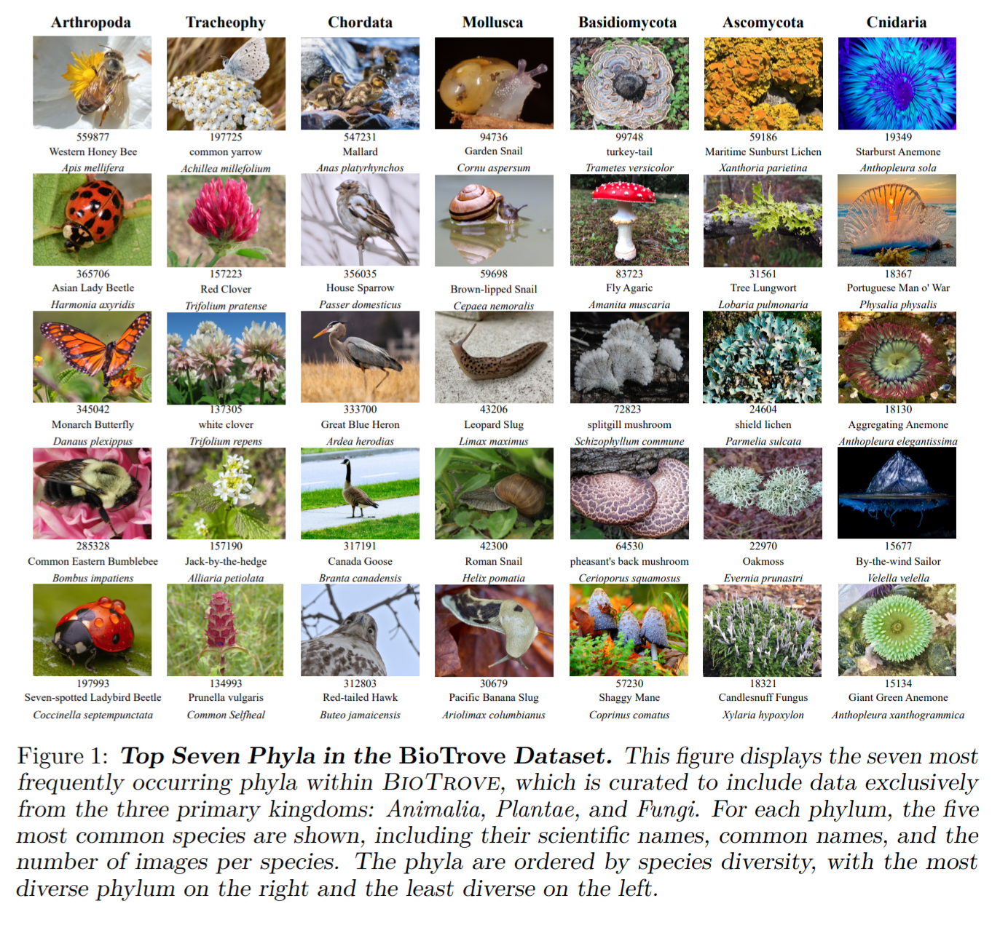
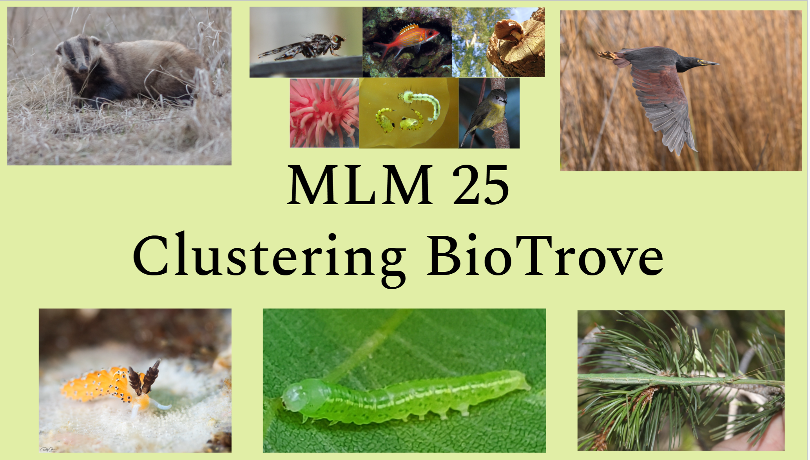
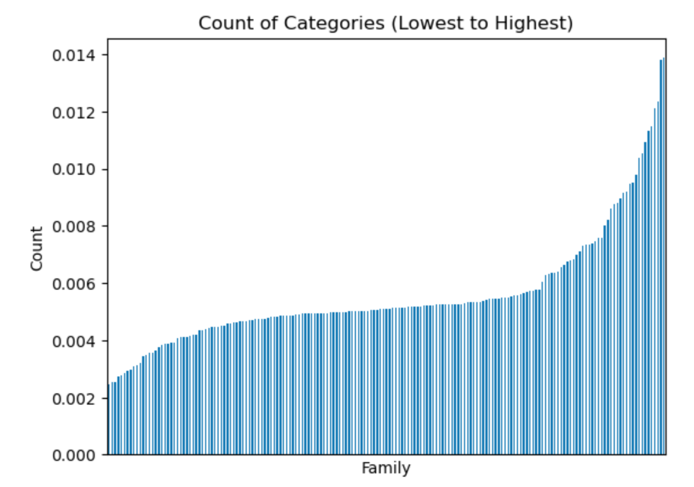
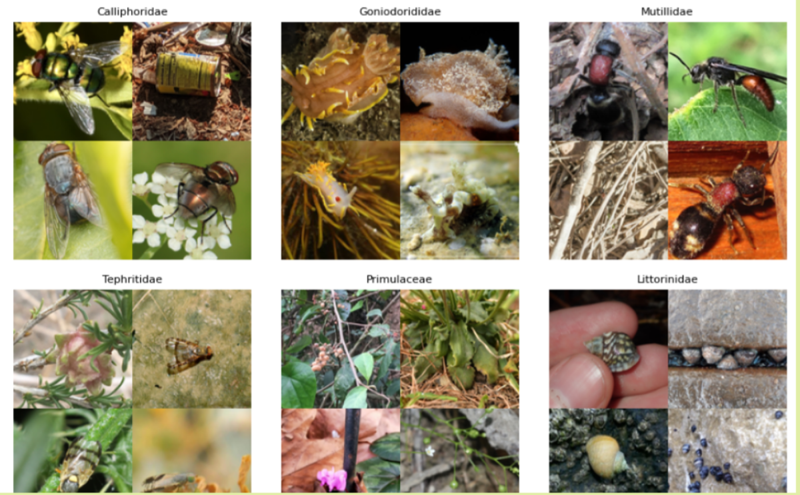
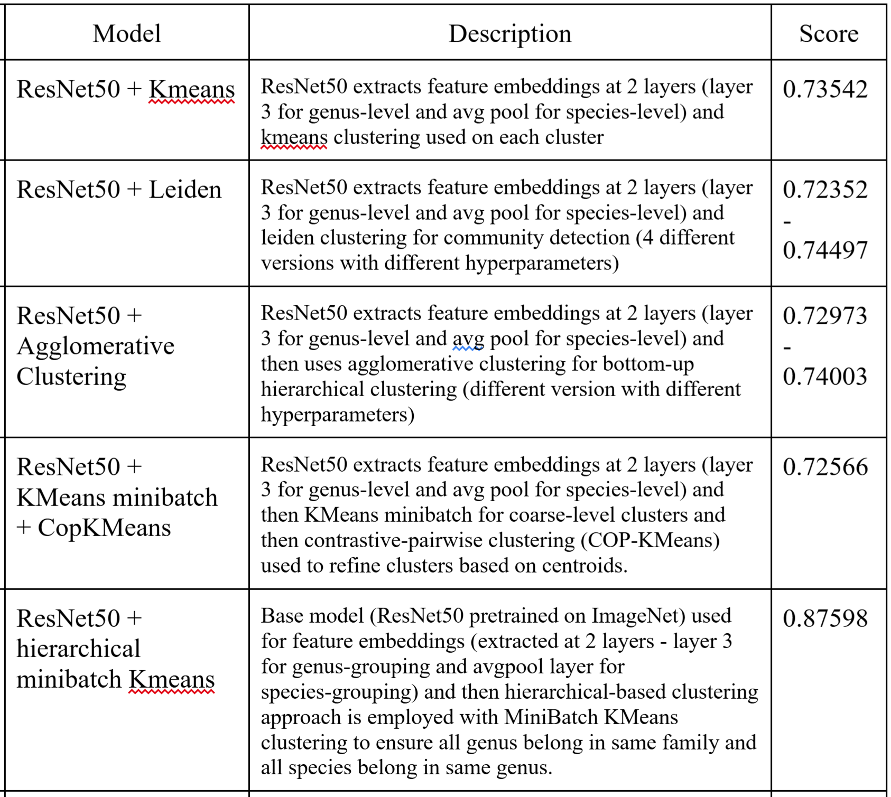
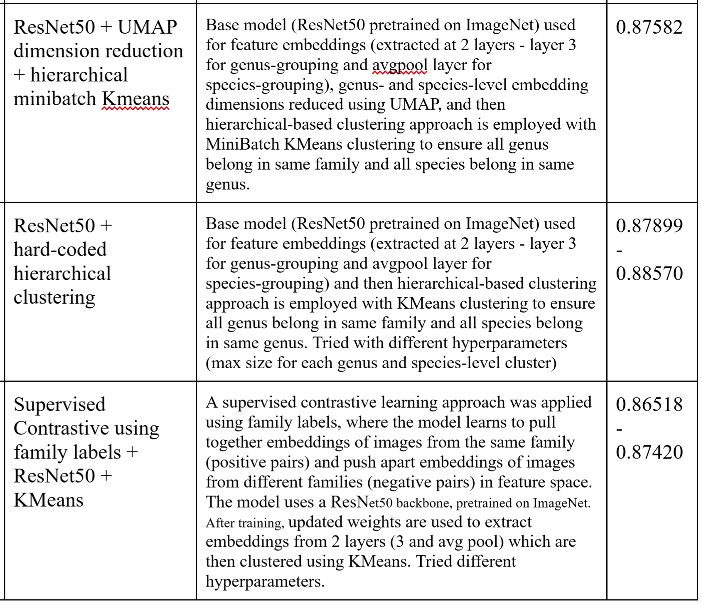
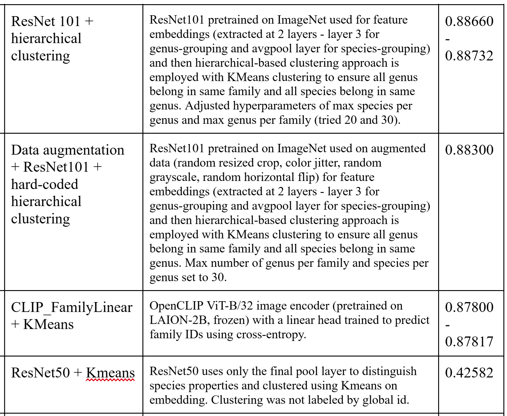
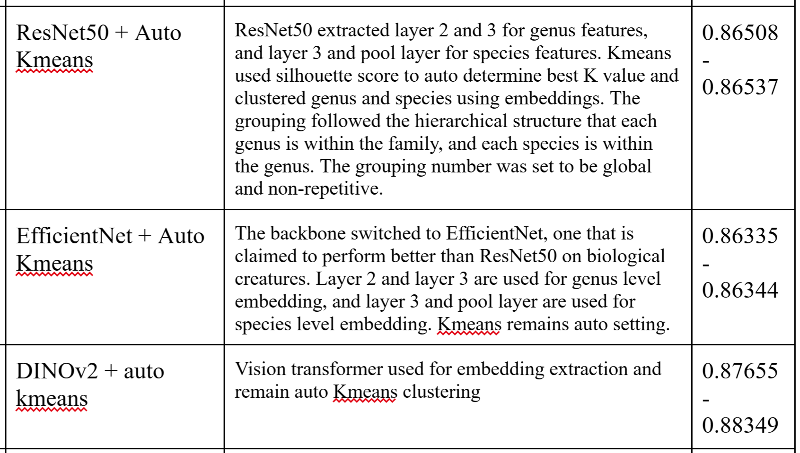
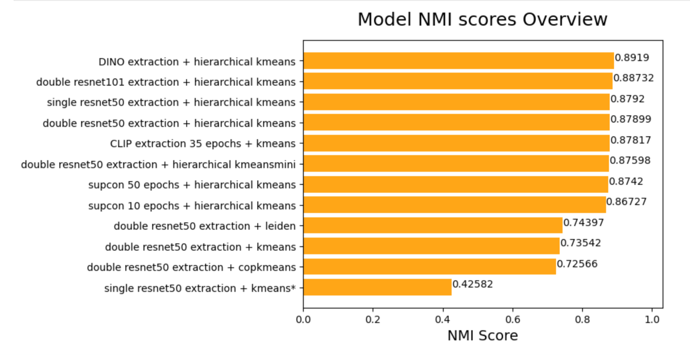

# "Clustering BioTrove" Challenge - BioTrove_1 Team Repo
## Overview
This repo covers the "BioTrove_1" team approach to the 2025 ML+X Machine Learning Marathon **Clustering-BioTrove** challenge. The BioTrove_1 team included 3 members: Chenchen D., Zhixing X., and Michal L. The Clustering-BioTrove challenge involves a subset of the original BioTrove biodiversity dataset which contains over 160 million images of living organisms with taxonomic information included. The "Clustering BioTrove" challenge contained 50k image subset of the original BioTrove dataset with only taxonomic family labels provided for each sample. The challenge is to use unsupervised learning (no genus or species labels provided) to produce genus- and species-level clusters. The included family labels can be used to improve clustering performance into the respective taxonomic level-representative groups. This README file includes information on the original BioTrove dataset, the Clustering-BioTrove challenge and dataset, and the approaches that were employed by our team during the challenge period (Fall 2025). 

## Statement on use of code from external sources
During the creation of our models, code was used from several online sources including forums such as stackoverflow and LLM models such as chatgpt or gemini. 

## Structure of Repo - How to Use
In order to share the work that each of the BioTrove_1 team members did on their own employing different approaches to tackle the challenge, each of the three team members has their own files in this repo where we each show our own unique models/approaches. These files can be identified by the first name of each team member (e.g. Chenchen, Zhixing, Michal). 

## Reproducing code
The data, both image files and corresponding metadata csv, can be found on the [Clustering BioTrove kaggle competition page](https://www.kaggle.com/competitions/biotrove-clustering/overview). See individual team member files for code to reproduce results. All code is in the **Python** language. Be sure to install required Python Packages. **PyTorch** was used for deep learning models.

## Background
### Original BioTrove Dataset
The original BioTrove dataset is described as "the largest publicly accessible dataset designed to advance AI applications in biodiversity". It was curated from the iNaturalist platform as part of an effort spanning several different universities in the United States, and includes 161.9 million images of living organisms with taxonomic information provided in metadata. It was released in 2024. A plethora of information about the original BioTrove dataset, including but not limited to: link to original paper, github repository, and example images, can be found [here](https://baskargroup.github.io/BioTrove/).

Yang, C.-H., Feuer, B., Jubery, Z., Deng, Z. K., Nakkab, A., Hasan, M. Z., Chiranjeevi, S., Marshall, K., Baishnab, N., Singh, A. K., Singh, A., Sarkar, S., Merchant, N., Hegde, C., & Ganapathysubramanian, B. (2024). Figure 1: Top Seven Phyla in the BioTrove Dataset. In BioTrove: A large curated image dataset enabling AI for biodiversity (NeurIPS Datasets and Benchmarks Track). Advances in Neural Information Processing Systems 37. Neural Information Processing Systems Foundation, Inc. https://doi.org/10.52202/079017-3241

### Clustering BioTrove Challenge

The "Clustering BioTrove" challenge was created by the ML+X machine learning organization from the University of Wisconsin-Madison as part of the 2025 Machine Learning Marathon competition. The challenge included a 49,633 image subset of the original BioTrove dataset with a corresponding metadata csv file that **only included** the unique image identifiers (**hash_id**), and **taxonomic family** names for the images. **179 unique taxonomic families** were represented in the "Clustering Biotrove" dataset. The goal of the challenge was to cluster the ~50k image dataset into genus- and species-level groupings with only the "hash_id" and "family" label provided for each individual image using **unsupervised learning approaches**. As the challenge was unsupervised, there was no ground truth data provided and results were formatted according to the challenge instructions into a csv file and submitted on kaggle for evaluation using the Normalized Mutual Information (NMI) metric.

Taxonomic families sorted by probability density

Sample of Clustering-Biotrove images by family

## BioTrove_1 Team Approach to Clustering-BioTrove Challenge
This challenge was each of our first experiences in a deep learning competition. As such, we kept our approach simple and consistent throughout the competition. Our general approach was to use some sort of deep learning architecture (CNN, ViT, etc.) to extract image embeddings from the image data, and then use some some unsupervised clustering algorithm (kmeans, ledien, etc.) to cluster the embeddings into genus-and species-level groups. We started by using a pretrained (on ImageNet) ResNet50 model to extract embeddings at a single layer and then clustering via kmeans. This strategy evolved to extracting at two layers (layer 3 and avg. pool layer) to capture some hierchical characheristic difference in images which would help distinguish the more general genus-level differences and the more local species-level differences in images. This evolved to trying many different clustering approaches, supervised contrastive learning with the family labels, pretrained vision transformer models for embedding extraction, and more.

## Model Scores
### Comparison chart with descriptions and NMI scores

### Non-exhaustive plot of model NMI scores.

